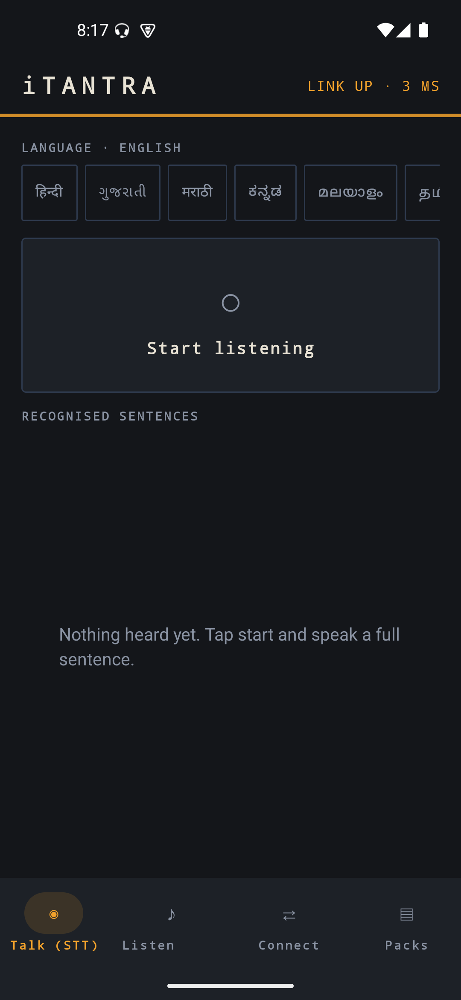
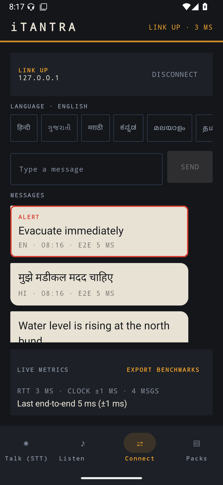
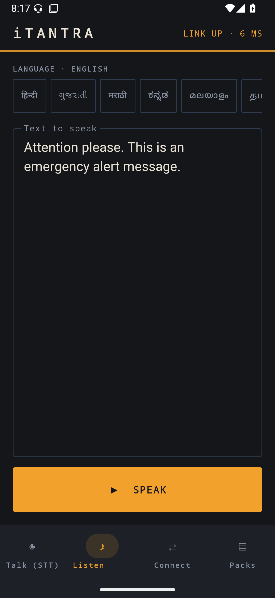
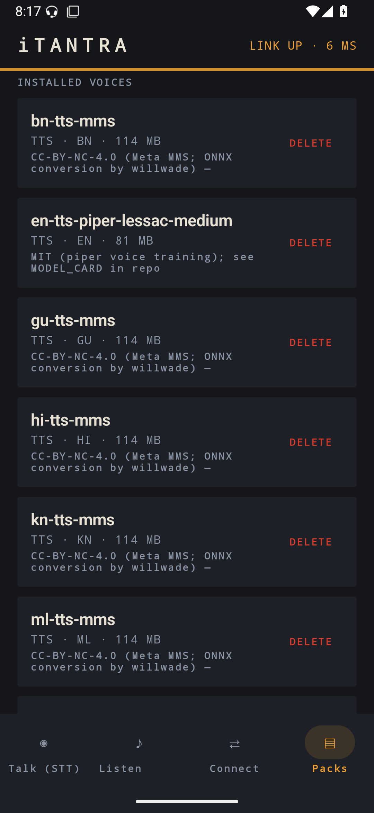

# iTantra — Offline Voice-over-Text Communicator

SIH 2026 **SIH26173** (ISRO, Dept. of Space): *Indian Multilingual TTS & STT Aided Neural Transceiver Radio Access for Low-Bitrate Links*.

**Concept:** never transmit audio over the low-bitrate link. The sender runs offline speech-to-text on-device, transmits **text** (tens of bytes per sentence instead of ~100 KB/s audio) over Wi-Fi/Bluetooth, and the receiver speaks it back with offline text-to-speech. Voice communication that fits low-bitrate links and works for everyone — literate or not.

**Status: Phases 0–7 complete.** Fully offline Android app, 10 Indian languages, walkie-talkie + phone modes, non-interruptible alerts, live latency metrics, CSV benchmark export, ESP32 reference receiver.

## Screens

| Talk — mic → STT | Link — the conversation |
|---|---|
|  |  |

| Listen — text → TTS | Packs — voice models |
|---|---|
|  |  |

The strip under the header is the **carrier bar** — it is the link state, on every screen: dim when there is none, a travelling pulse while reaching for a peer, solid amber when the carrier is up, red while an alert plays. Received messages render as paper slips, sent ones as ink on the panel; machine data (ids, latency, ACKs) is monospace, human speech is large sans.

## Quick start (Android Studio)

1. Open this folder in Android Studio (or use the Gradle wrapper + any JDK 21).
2. Run the `app` configuration on a device/emulator.
3. Install language packs (below). The Silero VAD ships inside the APK; STT/TTS models are downloaded or sideloaded, keeping the APK ~24–34 MB.

## Language packs

**In-app download (easiest):** open the app → **Packs** tab → *Install*.
Downloads from HuggingFace with progress + SHA-256 verification, then the app is fully offline.
(Handles HF rate limits with retry/backoff.)

**Via USB instead** (offline provisioning). Requires a Python venv at `tools/.venv` and packs built into `dist/packs/` — neither is tracked in git:

```
python -m venv tools/.venv && tools/.venv/Scripts/pip install requests
tools/.venv/Scripts/python tools/packs/build_pack.py --spec tools/packs/packs.json --all --out dist/packs
tools/android/install_packs.sh <phone-serial> multi-stt-omnilingual-300m-int8 en-tts-piper-lessac-medium hi-tts-mms
```

| Pack | Model | Licence |
|---|---|---|
| STT, Indic (9 languages) | Omnilingual 300M CTC INT8 | Apache-2.0 |
| STT, English | Whisper tiny INT8 | Apache-2.0 |
| TTS en | Piper lessac | MIT + research dataset voice |
| TTS hi/gu/mr/kn/ml/ta/te/or/bn | MMS VITS per-language | **CC-BY-NC-4.0** (competition use; see LICENSES.md) |

### Why two recognisers

The omnilingual model takes **no language argument** — its config exposes only a model path, and the output script follows the audio. That is right for the Indic languages, whose scripts are unambiguous, and it is measurably good: Kannada, Telugu, Odia and Bengali come back in native script.

English is routed to Whisper instead, which accepts an explicit `language`: correct script, punctuation (which feeds clause-splitting), and RTF 0.05 against omnilingual's 0.21.

Hindi and Marathi are the hard case and are handled separately — see below.

## Hindi, Marathi and the Urdu script

Hindi and Urdu are the same spoken language. Given live Hindi speech, the omnilingual recogniser hears it correctly and writes it in **Perso-Arabic** roughly half the time — `یہ ایک آپت کالین چتاونی ہے` is a phonetically exact rendering of *yeh ek aapatkaalin chetavani hai*. No voice pack here can pronounce that script, so those messages were being lost.

`UrduToDevanagari` converts them instead. It works because Urdu is an abjad that omits the short vowel *a* while Devanagari is an abugida where every bare consonant already carries one — `مدد` maps consonant-for-consonant to `मदद` with nothing to restore. What needs care is aspirates (`کھ` → ख as one letter), word-initial vowel forms, and `و`/`ی`, which are vowels after a consonant but glides after another vowel.

This is a **pronunciation aid, not a spelling engine**: you get आपत कालीन where a human writes आपातकालीन, because the missing pieces are short vowels the source script never recorded. The voice says the right sentence; the text is approximate. For a voice relay that is the right trade.

Whisper was evaluated for this and rejected. On the same clip at `language=hi`: tiny returned romanised Latin, base returned Perso-Arabic (no better than omnilingual), and small returned Devanagari with the leading characters of words dropped — sherpa-onnx mangles multi-byte UTF-8 in its Whisper decoding. Complete text in the wrong script beats shredded text in the right one. `SttEngine.MIN_WHISPER_RANK` is the single line to change if that is ever fixed upstream.

## Verify everything (as CI would)

```
./gradlew testDebugUnitTest              # 26 unit tests: protocol, clock-sync, normaliser, transliteration
./gradlew lintDebug                      # Android lint, clean
tools/android/run_verification.sh        # instrumented model tests on emulator/device
```

Headless end-to-end on a running app (debug builds only — the receiver is declared in `src/debug/`, so it does not exist in release APKs):

```
adb shell am broadcast -n isro.itantra/.DebugHookReceiver -a isro.itantra.DEBUG_HOST
adb shell am broadcast -n isro.itantra/.DebugHookReceiver -a isro.itantra.DEBUG_JOIN --es host <ip> --ei port <port>
adb shell am broadcast -n isro.itantra/.DebugHookReceiver -a isro.itantra.DEBUG_SEND --es lang hi --es text "…" --ez alert true
adb shell am broadcast -n isro.itantra/.DebugHookReceiver -a isro.itantra.DEBUG_STT_FILE --es path <wav> --es lang hi
adb shell am broadcast -n isro.itantra/.DebugHookReceiver -a isro.itantra.DEBUG_STATE
adb shell am broadcast -n isro.itantra/.DebugHookReceiver -a isro.itantra.DEBUG_EXPORT
```

Debug builds also write every captured utterance to `filesDir/audio/seg-*.wav` and log its level, so a transcript can be re-decoded offline through a different engine — that is what separates a capture problem from a decode problem.

### Two phones without two phones

An emulator sits behind its own NAT and cannot reach a handset on the LAN, so the link goes through adb: the phone hosts, and the emulator joins at `10.0.2.2` (the default in the Peer IP field).

```
tools/android/setup_phone_b.sh     # installs, sideloads packs, sets up adb forward
```

## Layout

| Path | Contents |
|---|---|
| `app/` | Compose UI + engines (STT/TTS/VAD), protocol, transports (TCP/BT), CommService, metrics |
| `app/src/main/java/isro/itantra/ui/` | the visual system — see `Panel.kt` for why it looks the way it does |
| `docs/` | `MASTER_BUILD_PROMPT.md` (spec) · `MODELS.md` · `BENCHMARKS.md` · `LICENSES.md` · `PROTOCOL.md` · `DEMO_SCRIPT.md` · screenshots |
| `tools/eval/` | desktop benchmarks + FLEURS WER scripts and results |
| `tools/packs/` | pack builder (manifest.json + SHA-256 zips) |
| `tools/android/` | pack sideloading, two-device setup, headless verification |
| `firmware/esp32/` | open-source reference receiver (SPP, CRC, ACK, buzzer) |

`dist/packs/` and `models/cache/` hold multi-gigabyte model artefacts and are not tracked.

## Measured

Emulator (x86_64) and desktop. **These are not phone numbers** — treat them as upper bounds on latency and lower bounds on accuracy until re-run on hardware.

- STT: RTF 0.07–0.09 live, 0.05 (Whisper, en). Native-script output verified for Kannada, Telugu, Odia, Bengali
- TTS: first clause 135 ms (en) / 226–677 ms (Indic), RTF 0.04–0.21
- Link: RTT 3–9 ms over the emulator/adb path; end-to-end 5 ms for a short message
- Release APK: 23.9 MB (armv7) / 33.5 MB (arm64) per-ABI + installed packs

Verified end to end across two devices: HELLO language negotiation, per-language TTS routing, ALERT preempting an in-progress message at a clause boundary and the interrupted message resuming afterwards, ACK-backed delivery status, and message flow surviving a peer restart.

## Honest gaps

- **On-phone benchmarks.** Everything above is emulator-measured. Accuracy in particular is sensitive to microphone quality — the same model produced clean native script on studio WAVs and mixed-script output on a low-level emulator mic.
- **No BLE transport.** `Wire.fragment()`/`Defragmenter` implement MTU-sized fragmentation and are unit-tested, but nothing calls them: the only transports are TCP and Bluetooth Classic RFCOMM. BLE would be new work on both sides.
- **Bluetooth is untested on hardware.** The code path exists and permissions are handled, but emulators cannot exercise it.
- **Hindi/Marathi text is approximate** after transliteration (see above). The `WORDS` dictionary that fixes the most common cases is 30 entries and should be extended by a native speaker — it is plain data.
- **Room persistence deferred** — message history is in-memory and does not survive a process restart.
- **UI strings added with the panel redesign are English-only** (`values/strings_untranslated.xml`); the original twelve are translated into all ten languages.
- **Indic TTS is CC-BY-NC** (team sign-off recorded in LICENSES.md), which rules out commercial distribution as-is.
